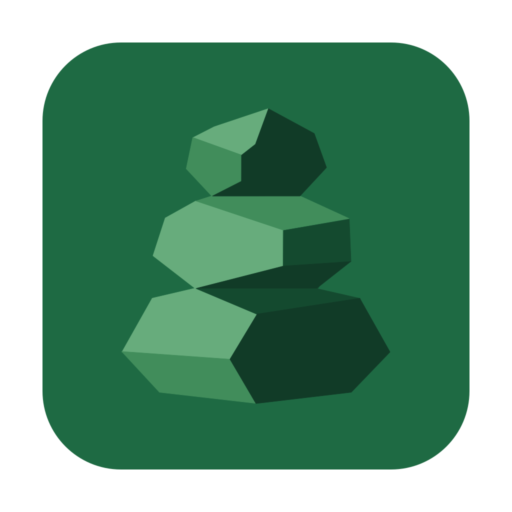
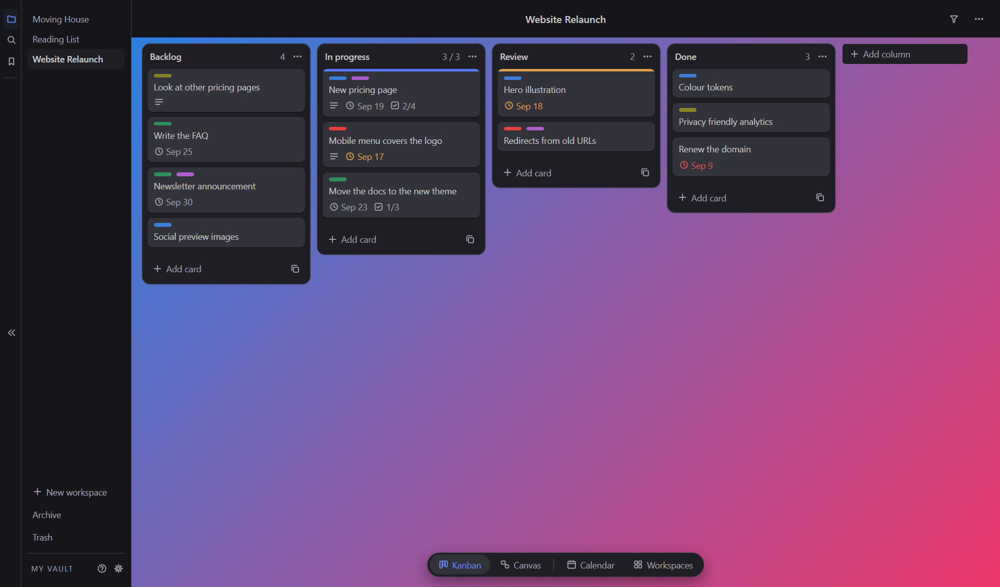
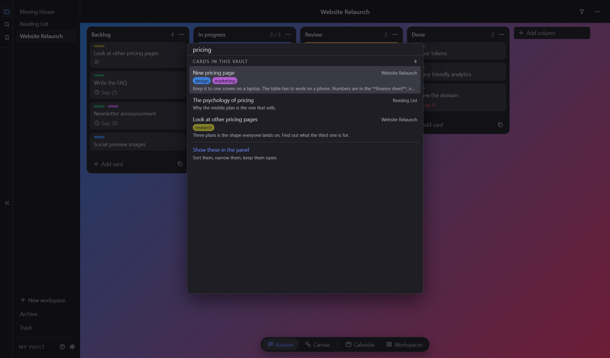
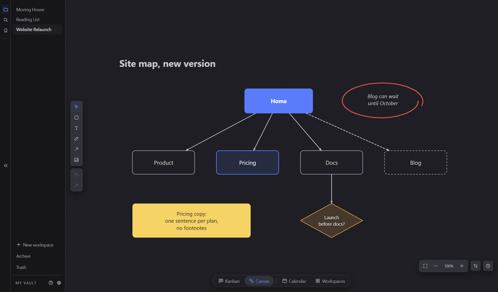
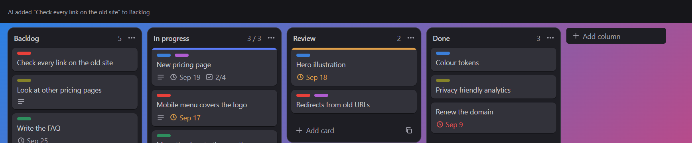
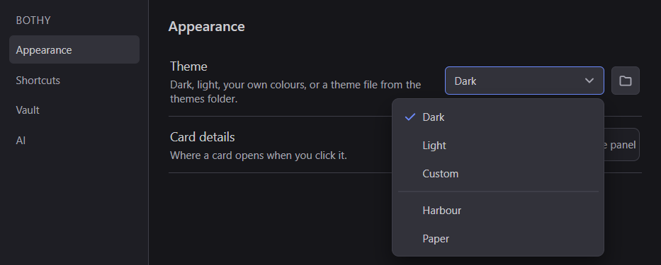

<p align="center">
  
</p>

<h1 align="center">Bothy</h1>

<p align="center">A local-first kanban and canvas, kept as plain files in a folder you own.<br>
An AI agent can work on it too, through its built-in MCP server, if you let it.</p>



---

Bothy is a desktop app for planning work. Each workspace has a kanban board and a
canvas. Everything lives in a folder on your disk as Markdown and JSON, so it can be
read, versioned and backed up with the tools you already use.

No account, no server, no sync. Close the app and your files are still just files.

What each version brought is on the
[releases page](https://github.com/ard0x10/Bothy/releases).

## The board



A vault holds workspaces, and each workspace is a folder with its own board. Cards carry
tags, dates, priority, checklists, attachments, custom fields and a cover the board
wears, and they move between columns by hand. There is a search across the whole vault,
a command palette and a filter bar, a global shortcut that takes a note down without
leaving whatever you were in, and a board can be sent out as a PNG. Dark, Light and
Custom sit in Settings, beside any theme file you have put in the folder
(see [Themes](#themes)).

## The calendar


Every dated card in the vault, drawn as a bar across the days it covers. Dragging a bar
moves the card's dates, and the calendar narrows with a filter of its own.

## The canvas



Every workspace comes with a canvas: boxes in several shapes, text, a pen and a
highlighter, an eraser, pictures. Arrows tie to objects and follow them when they move.
It selects, copies, undoes and redoes, and a canvas can be sent to somebody and brought
back on another machine.

## An agent, if you let one in



Bothy carries an MCP server. An agent can read the board and the canvas, add and move
cards, and draw. It is off until you turn it on in Settings, under AI, and you tick the
workspaces it may use one at a time. Everything an agent removes goes to the trash, and
its changes show a short notice that can be turned off. For agents without MCP,
[`docs/format.md`](docs/format.md) describes the files well enough to edit them directly.

## Getting started

You need [Git](https://git-scm.com/) and [Node.js](https://nodejs.org/) (Bothy is
developed on Node 24).

```sh
git clone https://github.com/ard0x10/Bothy.git
cd Bothy
npm install
npm start
```

`npm start` builds the app and opens it. The first time, press **Choose vault** and pick
the folder to keep your work in.

### A Start Menu shortcut (Windows)

After Bothy has been opened once with `npm start` (the first start downloads Electron):

```sh
npm run shortcut
```

This puts Bothy in the Start Menu and on the Desktop, with its icon, and it can be
pinned to the taskbar. The shortcut runs the app from this folder, so keep the folder
where it is.

The shortcut starts `runtime\Bothy.exe`, Electron under Bothy's name, so Task Manager
lists the app as Bothy. After an update that brings a new Electron, run
`npm run shortcut` again.

### Connecting an agent

Open Settings, turn on **AI access**, and tick the workspaces an agent may use.
The same page shows the settings block to paste into your MCP client, and a command
for clients started from a terminal. Both point at the server in this folder.

## Your files

```
My Vault/
  Project/
    workspace.json
    kanban/
      columns.json
      cards/
        fix-audio-bug.md
    canvas/
      canvas.json
    files/
```

Cards are Markdown with YAML frontmatter, and any key Bothy does not know is kept as
it is. The full format is in [`docs/format.md`](docs/format.md).


That card, on disk:

```md
---
id: k_a201
title: New pricing page
cover: "#5b7cfa"
tags:
  - blue
  - purple
start: 2026-09-14
due: 2026-09-19
priority: high
checklists:
  - name: Checklist
    items:
      - text: Three plans, one table
        done: true
      - text: Yearly and monthly toggle
        done: true
      - text: Copy review
        done: false
      - text: Mobile layout
        done: false
created: 2026-09-10
owner: Sam
---

Keep it to one screen on a laptop. The table has to work on a phone.

Numbers are in the **finance sheet**, not here.
```

Bothy's own settings (theme, colours, the last vault, AI access) are kept outside the
vault, in `%APPDATA%\bothy` on Windows.

## Themes



Settings, under Appearance, lists Dark, Light and Custom, then every theme file in the
themes folder. The folder button beside the list opens it (`%APPDATA%\bothy\themes` on
Windows). A file put there shows in the list straight away, and a change to the file in
use shows on the window as soon as it is saved.

A theme is one `.json` file:

```json
{
  "bothyTheme": 1,
  "name": "Harbour",
  "author": "someone",
  "base": "dark",
  "colors": {
    "bg-app": "#141b22",
    "bg-column": "#1b242d",
    "bg-card": "#26323d",
    "accent": "#e6a15c"
  }
}
```

- `base` is `dark` or `light`. It gives the shadows, the scrollbars and every colour the
  file leaves out.
- `colors` takes any of these, each as `#rrggbb`: `bg-app` (the window), `bg-column`
  (columns), `bg-card` (cards and sheets), `bg-card-hover` (a card under the pointer),
  `text`, `text-dim` (quiet text), `border`, `accent`, `on-accent` (text on the accent),
  `late` (overdue) and `soon` (due soon).
- `name` is what the list shows, and the file name stands in without it. `author` is
  optional.

A file that does not read stays in the list, greyed, and says what is wrong with it.
To make one from the app, choose Custom, set the colours and the base, and press
**Save as theme**.

## Platform

Built and used on Windows. It is an Electron app and should run from source on macOS
and Linux, but those have not been tried.

## License

[MIT](LICENSE)
