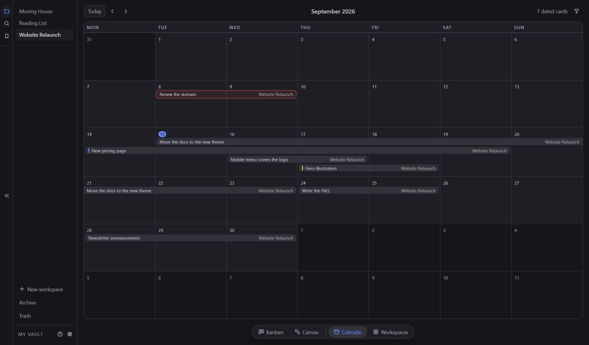
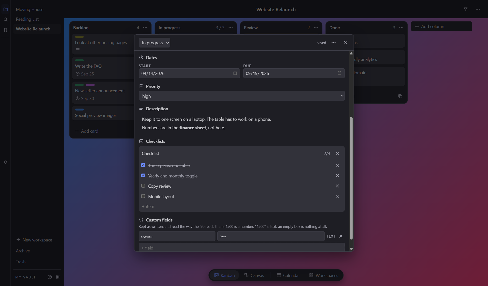

<p align="center">
  
</p>

<h1 align="center">Bothy</h1>

<p align="center">A local-first kanban and canvas, kept as plain files in a folder you own.</p>


---

Bothy is a desktop app for planning work. Each workspace has a kanban board and a
canvas. Everything lives in a folder on your disk as Markdown and JSON, so it can be
read, versioned and backed up with the tools you already use, and an AI agent can work
on it too, if you let it.

No account, no server, no sync. Close the app and your files are still just files.

## What is in v0.4

**Kanban**
- Vaults and workspaces, each workspace a folder with its own board
- Cards as Markdown files with frontmatter: tags in six colours, start and due dates,
  priority, checklists, attachments, cover colours or pictures, custom fields
- Drag cards and columns, column limits, archive and trash
- Search, a command palette, a filter bar and card templates
- A calendar of every dated card; dragging a bar moves its dates
- Quick capture from anywhere with a global shortcut while Bothy is running
- Light and dark themes, with the main colours adjustable in Settings
- Export a board as a PNG



**Canvas**
- Boxes in several shapes, text, pen and highlighter, eraser, pictures
- Arrows that tie to objects and follow them when they move
- Selection, copy, undo and redo
- Import and export


**AI access**
- A built-in MCP server: an agent can read the board and the canvas, add and move
  cards, and draw on the canvas
- Off by default. You choose in Settings, under AI, which workspaces an agent may use
- Everything an agent removes goes to the trash, and its changes show a short notice
  that can be turned off
- For agents without MCP, [`docs/format.md`](docs/format.md) describes the files
  so they can be edited directly


## Getting started

You need [Git](https://git-scm.com/) and [Node.js](https://nodejs.org/) (Bothy is
developed on Node 24).

```sh
git clone https://github.com/ard0x10/Bothy.git
cd Bothy
npm install
npm start
```

`npm start` builds the app and opens it. The first time, press **Choose vault** and pick
the folder to keep your work in.

### A Start Menu shortcut (Windows)

After Bothy has been opened once with `npm start` (the first start downloads Electron):

```sh
npm run shortcut
```

This puts Bothy in the Start Menu and on the Desktop, with its icon, and it can be
pinned to the taskbar. The shortcut runs the app from this folder, so keep the folder
where it is.

### Connecting an agent

Open Settings, turn on **AI access**, and tick the workspaces an agent may use.
The same page shows the settings block to paste into your MCP client, and a command
for clients started from a terminal. Both point at the server in this folder.

## Your files

```
My Vault/
  Project/
    workspace.json
    kanban/
      columns.json
      cards/
        fix-audio-bug.md
    canvas/
      canvas.json
    files/
```

Cards are Markdown with YAML frontmatter, and any key Bothy does not know is kept as
it is. The full format is in [`docs/format.md`](docs/format.md).



That card, on disk:

```md
---
id: k_a201
title: New pricing page
cover: "#5b7cfa"
tags:
  - blue
  - purple
start: 2026-09-14
due: 2026-09-19
priority: high
checklists:
  - name: Checklist
    items:
      - text: Three plans, one table
        done: true
      - text: Yearly and monthly toggle
        done: true
      - text: Copy review
        done: false
      - text: Mobile layout
        done: false
created: 2026-09-10
owner: Sam
---

Keep it to one screen on a laptop. The table has to work on a phone.

Numbers are in the **finance sheet**, not here.
```

Bothy's own settings (theme, colours, the last vault, AI access) are kept outside the
vault, in `%APPDATA%\bothy` on Windows.

## Platform

Built and used on Windows. It is an Electron app and should run from source on macOS
and Linux, but those have not been tried.

## License

[MIT](LICENSE)
